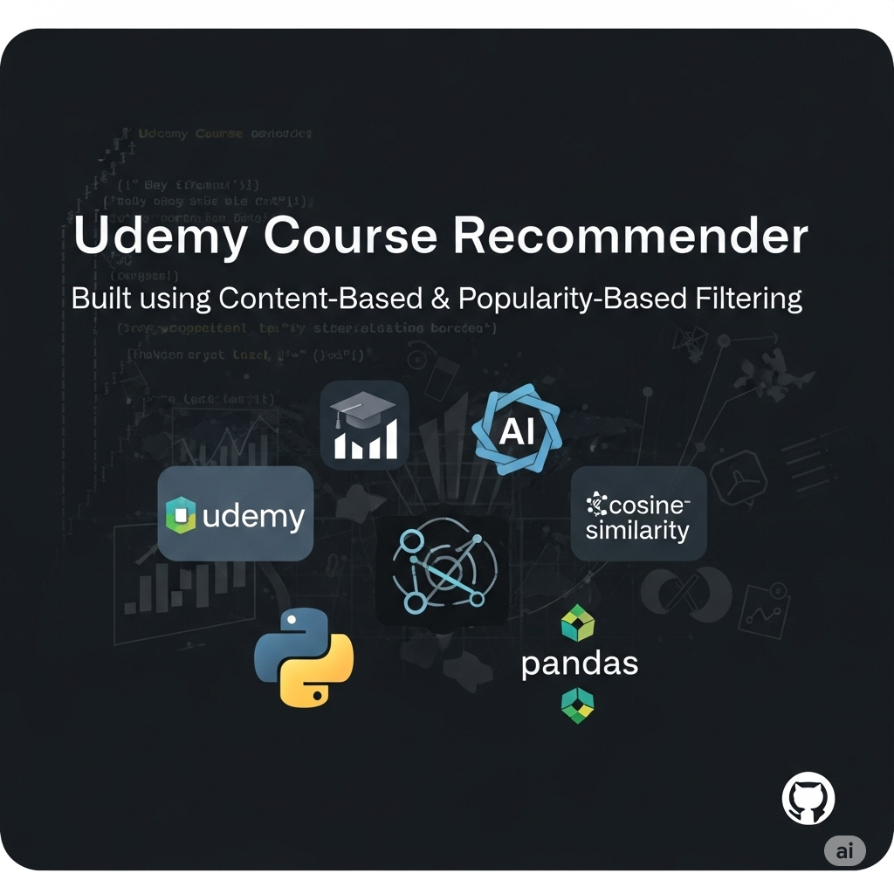

# 🎓Udemy-Course-Recommendation-system

A smart, efficient recommendation system that suggests Udemy courses based on course content and popularity. Built using Natural Language Processing (NLP) techniques, this project applies both content-based filtering and popularity-based recommendation logic.

## 📌 Project Overview

This project leverages a real-world Udemy dataset from Kaggle and implements two types of recommendation engines:

- **Popularity-Based Recommender**: Recommends top-rated courses based on number of subscribers and reviews.
- **Content-Based Recommender**: Recommends similar courses based on course titles and subjects using NLP and cosine similarity.

## 🚀 Key Features

- Cleaned and preprocessed course data
- EDA visualizations with Seaborn and Matplotlib
- NLP-based preprocessing 

- Content vectorization with  `TfidfVectorizer`
- Cosine similarity-based recommendation engine
- Popularity-based ranking logic
- Modular, beginner-friendly code structure

## 📊 Technologies Used

- **Python** (Pandas, Numpy, Scikit-learn)
- **Data Visualization**: Matplotlib, Seaborn
- **NLP**:  TfidfVectorizer
- **Recommendation Engine**: Cosine Similarity
  

## 🧠 How It Works

- The **content-based system** cleans course titles and subjects using NLP techniques.
- Text features are vectorized using CountVectorizer/TF-IDF.
- Cosine similarity scores are computed between courses.
- The top 5 most similar courses are recommended to the user.
- The **popularity-based system**  ranks courses by subscribers and reviews.

## 📈 Exploratory Data Analysis (EDA)

- Distribution of course subjects and pricing
- Correlation heatmaps for reviews, subscribers, content length
- Count plots for course levels and subject categories
- Scatter plots for number of subscribers, content length and Price

## 📌 Future Improvements

- Add Collaborative Filtering
- Deploy with Streamlit or Flask

## 🔗 Dataset

Dataset used: [Udemy Courses Dataset from Kaggle](https://www.kaggle.com/datasets/thedevastator/udemy-courses-dataset)

